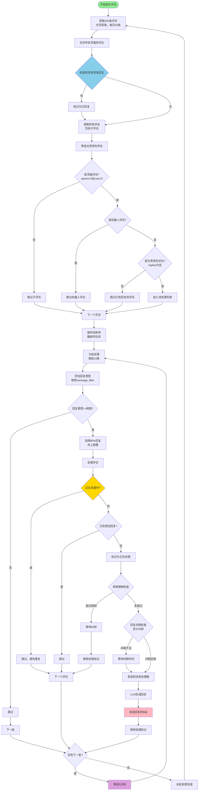

# B站评论获取与回复流程图

## 关键检查点

1. **筛选条件**（必须全部满足）：
   - ✅ 是顶级评论（parent=0 且 root=0）
   - ✅ 是光秃秃的评论（replies为空）
   - ✅ 不是机器人自己的评论

2. **处理前检查**：
   - ✅ 是否正在处理中（避免并发重复）
   - ✅ 是否已有悠怡回复（避免重复回复）
   - ✅ 频率限制检查
   - ✅ 回复间隔检查（至少30秒）

3. **回复意愿筛选**：
   - ✅ 使用 message_filter 评估
   - ✅ 只回复意愿 >= 阈值的评论
   - ✅ 每批回复80%（向上取整）

## 时间控制

- **获取评论间隔**：每页之间等待2秒
- **回复间隔**：至少30秒
- **批次间隔**：处理完一批后等待5分钟
- **频率限制**：每小时最多回复20条

